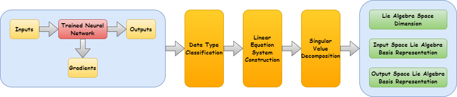

# Symmetry Discovery for Different Data Types

This repository is the official implementation of Symmetry Discovery for Different Data Types.



## Requirements

To install requirements:

```shell
pip install -r requirements.txt
```

To install Adan:

```shell
git clone https://github.com/sail-sg/Adan.git
cd Adan
python3 setup.py install --unfused
```

To download the top quark tagging dataset:

```shell
wget -P ./data/top-quark-tagging https://zenodo.org/records/2603256/files/train.h5
```

## Experiments

### Two-body problem

To use LieSD for symmetry discovery in the two-body problem on the uniform dataset, run this command:

```shell
python main_liesd.py --dataset 2body --num_epochs 10 --D 1 --gpu [gpu] --seed [seed]
```

To use LieSD ($k$-NN) for symmetry discovery in the two-body problem on the uniform dataset, run this command:

```shell
python main_liesd_knn.py --dataset 2body --n_neighbors -1 --D 1
```

To use LieGAN (baseline) for symmetry discovery in the two-body problem on the uniform dataset, run this command:

```shell
cd baseline && python main_baseline.py --g_init 2*2_factorization --lamda 1 --sigma_init 1 --num_epochs 100 --gpu [gpu] --seed [seed]
```

To use LieSD for symmetry discovery in the two-body problem on the non-uniform dataset, run this command:

```shell
python main_liesd.py --dataset 2body --num_epochs 10 --D 1 --non_uniform --gpu [gpu] --seed [seed]
```

To use LieGAN (baseline) for symmetry discovery in the two-body problem on the non-uniform dataset, run this command:

```shell
cd baseline && python main_baseline.py --g_init 2*2_factorization --lamda 1 --sigma_init 1 --num_epochs 100 --non_uniform --gpu [gpu] --seed [seed]
```

### The moment of inertia matrix prediction

To use the tensor form of LieSD for symmetry discovery in predicting the moment of inertia matrix (w/o noise), run this command:

```shell
python main_liesd.py --dataset inertia --N 100000 --k 3 --num_epochs 100 --D 5 --tensor --gpu [gpu] --seed [seed]
```

To use the tensor form of LieSD ($k$-NN) for symmetry discovery in predicting the moment of inertia matrix (w/o noise), run this command:

```shell
python main_liesd_knn.py --dataset inertia --N 100000 --k 3 --n_neighbors -1 --D 5 --tensor
```

To use the vector form of LieSD (baseline) for symmetry discovery in predicting the moment of inertia matrix (w/o noise), run this command:

```shell
python main_liesd.py --dataset inertia --N 100000 --k 3 --num_epochs 100 --D 5 --gpu [gpu] --seed [seed]
```

To use the tensor form of LieSD for symmetry discovery in predicting the moment of inertia matrix (w/ noise), run this command:

```shell
python main_liesd.py --dataset inertia --N 100000 --k 3 --num_epochs 100 --D 5 --tensor --noise 0.1 --gpu [gpu] --seed [seed]
```

To use the tensor form of LieSD ($k$-NN) for symmetry discovery in predicting the moment of inertia matrix (w/ noise), run this command:

```shell
python main_liesd_knn.py --dataset inertia --N 100000 --k 3 --n_neighbors -1 --D 5 --tensor --noise 0.1
```

To use the vector form of LieSD (baseline) for symmetry discovery in predicting the moment of inertia matrix (w/ noise), run this command:

```shell
python main_liesd.py --dataset inertia --N 100000 --k 3 --num_epochs 100 --D 5 --noise 0.1 --gpu [gpu] --seed [seed]
```

### Top quark tagging

To use LieSD for symmetry discovery in top quark tagging (w/o noise), run this command:

```shell
python main_liesd.py --dataset top_quark_tagging --n_component 20 --num_epochs 100 --D 9 --gpu [gpu] --seed [seed]
```

To use LieGAN (baseline) with 7 channels for symmetry discovery in top quark tagging (w/o noise), run this command:

```shell
cd baseline && python main_baseline.py --task top_tagging --lamda 1 --g_init random --n_channel 7 --y_type scalar --sigma_init 1 --eta 0.1 --n_component 200 --num_epochs 100 --gpu [gpu] --seed [seed]
```

To use LieGAN (baseline) with 9 channels for symmetry discovery in top quark tagging (w/o noise), run this command:

```shell
cd baseline && python main_baseline.py --task top_tagging --lamda 1 --g_init random --n_channel 9 --y_type scalar --sigma_init 1 --eta 0.1 --n_component 200 --num_epochs 100 --gpu [gpu] --seed [seed]
```

To use LieSD for symmetry discovery in top quark tagging (w/ noise), run this command:

```shell
python main_liesd.py --dataset top_quark_tagging --n_component 20 --num_epochs 100 --D 9 --noise 0.1 --gpu [gpu] --seed [seed]
```

To use LieGAN (baseline) with 7 channels for symmetry discovery in top quark tagging (w/ noise), run this command:

```shell
cd baseline && python main_baseline.py --task top_tagging --lamda 1 --g_init random --n_channel 7 --y_type scalar --sigma_init 1 --eta 0.1 --n_component 200 --num_epochs 100 --noise 0.1 --gpu [gpu] --seed [seed]
```

To use LieGAN (baseline) with 9 channels for symmetry discovery in top quark tagging (w/ noise), run this command:

```shell
cd baseline && python main_baseline.py --task top_tagging --lamda 1 --g_init random --n_channel 9 --y_type scalar --sigma_init 1 --eta 0.1 --n_component 200 --num_epochs 100 --noise 0.1 --gpu [gpu] --seed [seed]
```

### Rotated MNIST

To use LieSD for symmetry discovery in rotated MNIST, run this command:

```shell
python main_liesd.py --dataset mnist --num_epochs [num_epochs] --D 1 --degree [degree] --gpu [gpu] --seed [seed]
```

To use LieGAN (baseline) for symmetry discovery in rotated MNIST, run this command:

```shell
cd baseline && python main_baseline.py --task mnist --lamda 1 --g_init random --n_channel 1 --x_type image --y_type scalar --sigma_init 1 --eta 0.1 --num_epochs [num_epochs] --degree [degree] --gpu [gpu] --seed [seed]
```